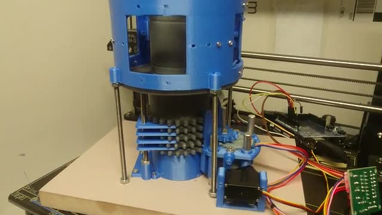
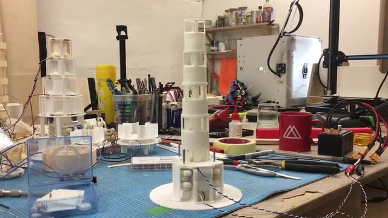
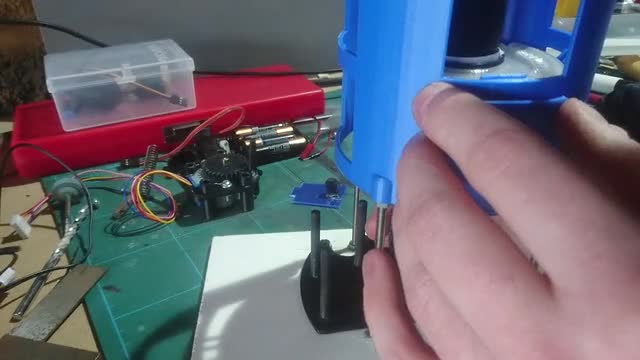
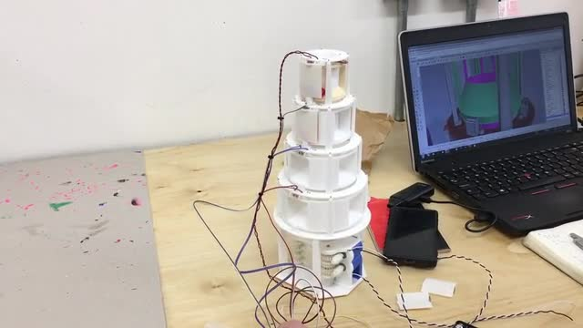
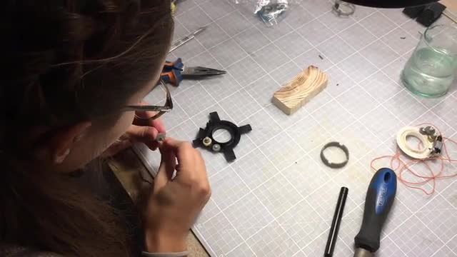
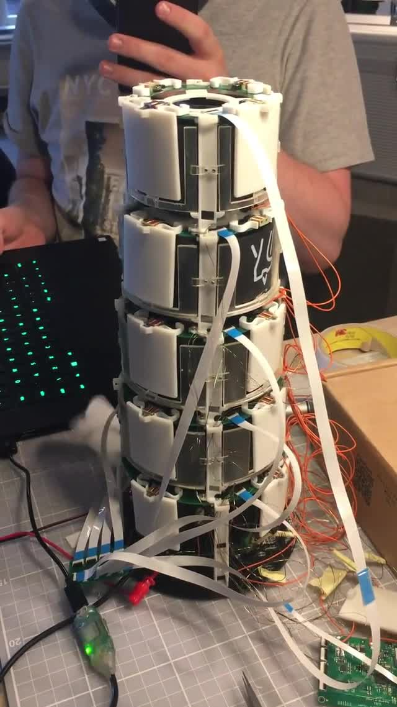

# The 8 Stages of Grief, errr, Tower Design by Tim Burrell-Saward
**Update #7 — January 21, 2020**
*Restoration Games*
**Source:** https://www.kickstarter.com/projects/restorationgames/return-to-dark-tower/posts/2735575

---

The tower you're looking at on the Kickstarter page is the Mark 8. Meaning that seven distinct revisions existed before this one. The journey from one to eight is what I thought I'd write about for this post.

As I mentioned in my last design diary, we'd decided on a suite of functionality that would allow us to create a compelling gameplay experience. The tower would consist of several stacked layers, each of which would rotate. The core would be hollow to act as a dice tower of sorts. It would have light and sound, and it would need to talk to a connected smartphone. It would need to be reliable, durable and safe. It would need to be kept to a budget. And lastly, wherever possible it should break down into its components for repair and recycling at the end of its life.

This set of constraints needed constant monitoring during the design process, as putting too much focus on one can easily lead to the neglect of another. Balance like this is present in every single product that's ever existed and takes an awful lot of blood, sweat and tears to achieve. So toss a coin to your designers, oh backers of plenty, because none of this stuff is particularly easy.

---

## The Mark 1

The Mark 1 tower really only existed as a means of testing mechanisms. I tend to start with the hard problems, which in this case is the revolution method. The original Dark Tower had a single DC motor which meant that all of the tower's levels rotated at the same time. We wanted our levels to rotate individually, and ideally in both directions, so that called for a different approach.

For the Mk 1 we decided to use stepper motors, which unlike a DC motor allows us to tell the motor to go to a specific position, rather than just being able to turn it on or off. Stepper motors can be found in things like printers and CD drives, where precision control is required. For Mk1 we needed two motors: one to control the horizontal revolution of the levels, and another to vertically select the level.

[▶ Watch video](videos/post_2735575_8_stages_of_grief_tim_burrell_saward/323ff1d1c77ea80fcdaa52f59bff3693_h264_base.mp4)

Having thrown a couple of weeks into getting a nice reliable action, we had something that worked. But a big part of designing for manufacture is making sure that design choices are going to be affordable, so at this point I jump on a call with my manufacturing contact in Hong Kong (a wonderful chap called Andrew who works longer hours than anyone I've ever met and can eat his own bodyweight in buffet food). Andrew's job is to act as a kind of translator between me and the factories, literally (as many don't speak English) and figuratively (to make sure my designs are faithfully translated into reality).

Andrew patiently listens to me try to describe the thing I'm making: *"Andrew, it's a giant evil spinny tower with lights and stuff. Yeah I know it sounds ridiculous, but nerds go crazy for this kind of thing."* Andrew makes some calls and tells me that stepper motors are going to be too expensive, which leads to the first of many back-to-the-drawing-board moments. In this line of work these moments are many and frequent, and entirely part of the process.

---

## The Mark 2

The Mark 2 tower used two DC motors rather than steppers. These motors had double ends, onto which we attached two little worm gears. Each of those gears meshed with a series of larger gears, which in turn were attached to a set of concentric shaft rising vertically up the centre of the tower. This setup meant that if we told this first motor to turn clockwise, level one would rotate clockwise. If we told the same motor to turn counter-clockwise, level 2 would turn in the same direction. So this way we get four levels of individual rotation, but only using two motors. Neat, right?

Yes and no. In mass manufacture, efficiency rules. You need to get the most function out of the smallest amount of parts and materials. This is to keep costs down, as more parts = more materials, more moulds and more assembly costs. So although the Mark 2 only used two motors, it used a lot of plastic in the four concentric vertical shafts. It worked, but not in a particularly elegant way. Definite room for improvement.

---

[▶ Watch video](videos/post_2735575_8_stages_of_grief_tim_burrell_saward/c94a0cdc42d39488fa07e42274fd90ba_h264_high.mp4)

## Marks 3 and 4 — Doors and Skull Ejection

For Mark 3 and 4 we parked the rotation challenge and focused on the doors and skull ejection system. As Rob wrote in his last update, projects like this always start out with a lot more stuff than makes it into the final box, and the tower is no different. We decided early on that it would be super cool if the tower could open its doors automatically, so Marks 3 and 4 were all about that.

Firstly we tried building little spring catches into each door, that would be activated by the drum rotation. But that meant we'd need a lot of very fiddly assembly, and each drum would need to rotate in both directions (clockwise to reveal the openings, counter clockwise to detach the doors), which would have meant needing more than two motors. Incidentally we ended up coming back to dual rotation, but that came much later.

[▶ Watch video](videos/post_2735575_8_stages_of_grief_tim_burrell_saward/0df10df01daced09681f879f2213cc6f_h264_high.mp4)

For Mark 4 we decided to look into using electromagnets, which are pretty much the same as normal magnets bar the fact that they lose their magnetism if you feed them power (or vice-versa, depending on which ones you use). This meant that we could fix a tiny magnet to each door and then send a small electrical pulse to tell the magnet to spring off.

Now often when you're prototyping you want to try something out without spending too much time or money on it. Wanting to try out the electromagnet idea, we could have found a factory in China to make us some bespoke components, but that would have been overkill. So instead we looked around to see what we could cannibalise to use as a stand in. I'm happy to share that, if you're ever in need of a bunch of tiny electromagnets, your salvation comes in the form of old CD drives. A whole heap of them. So several eBay purchases later we had enough drives to prototype an entire tower's worth of automatically opening doors.

---

[▶ Watch video](videos/post_2735575_8_stages_of_grief_tim_burrell_saward/0a0e6c0b29a0068f5673fabee27ba07a_h264_high.mp4)

## The Skull Distribution Problem

At the same time we also started to look at the third problem: the cube tower. Not only did the tower's layers need to rotate and its doors open, but skulls (or cubes as they were at the time), needed to find their way down through the tower's core and out of said doors. And more than that, they had to distribute evenly.

So around this point I built an entirely separate tower just to test probability and distribution. There were a lot of variables to tune here — the aperture size at each level, the length and pitch of the funnel at the top, the shape of the central core. We tried a giant central spiral for the skulls to tumble down. We punctured the core with sticks like a game of Kerplunk. We made shelves and protrusions and slopes and flaps. Things got very complicated very quickly.

And usually when this happens, the best thing to do is strip everything out, go back to basics, and generally you'll find something neat and elegant. In our case, all it took was to build a horizontal "collar" into each level (shaped like a polo mint), shaped in such a way as to deflect the course of a skull that hits it. Each level has a different sized collar to ensure that we get an even distribution.

And how did we figure the distribution out? Through hours and hours spent manually dropping skulls into the tower. Friends you do not know suffering until you've been tasked with dropping small bits of plastic into a tower for hours on end. The mere thought of that spreadsheet gives me chills. But it was a task that had to be done so that your Kingdom gets exactly its fair share of corruption.

---

## The Mark 5

For the Mark 5 tower we went into some more detail on the way that the rotating levels interfaced with the doors. This is where seemingly small gameplay changes started to have much bigger knock-on effects onto our design process.

For instance — if there's a skull sat behind a door that is yet to open, and the tower rotates, should the skull stay behind that door, or should it rotate too? Both are possible, but both have quite a large impact on how the game plays. How do you decide? You kiss goodbye to your wife and family for a week, chain yourself to your desk and make them both. Sometimes you can only be sure by making a thing real and seeing how it plays, and the bigger the decision, the more important that process becomes. The skulls rotate, by the way — the other version sucked.

At this point we also made the jump from two larger motors at the base of the tower to smaller ones distributed at each level, as it turned out that this would make the assembly easier and therefore more cost efficient. Manufacturing can be weird like that — sometimes adding more can make things cost less.

---

[▶ Watch video](videos/post_2735575_8_stages_of_grief_tim_burrell_saward/dabd4f5622e9381fcf03fcffef35aa42_h264_base.mp4)

## The Mark 6 — Coming to Life

Mark 6 became the culmination of our findings to date. The drums all rotated independently. The doors automatically ejected. Skull distribution was good. We added lights above each door and runes to the rotating parts, and finally connected everything up to the custom PCBs that Charlie had been slaving over. We integrated it into the prototype app that Porcelain Fortress had made. And suddenly, the tower came to life.

[▶ Watch video](videos/post_2735575_8_stages_of_grief_tim_burrell_saward/27df478570735ffc6f3240f8601771c2_h264_high.mp4)

If you happened to catch the game at Gen Con last year, this is the tower you saw. We got some good playtest feedback from the show, people seemed to like the direction, and nobody lost a finger (which is surprising seeing as it was held together by superglue, tape and tears).

---

## The Mark 7 — Listening to Feedback

Mark 7 was all about acting on the feedback from Gen Con, as well as working with Andrew in China to try to get the design under budget. The biggest change was the decision to remove the electromagnetically controlled doors. As cool as they were, having your board state wiped out by a falling piece of plastic quickly lost its charm.

There's an important design lesson here — as a creator, no matter how much you may love something, if your audience doesn't agree then you should really listen to them. We were also quite horribly over budget at this stage, so the decision was taken to change the doors to simple slide-to-open parts. In hindsight I actually prefer this, as seeing the sinking feeling on a player's face when they start to open a door, only to see the glint of white skulls behind it, is delicious.

We also made the decision to chop an entire level from the tower, which we learned was superfluous to the game design (and also helped with cost). Once upon a time the tower was even bigger than it is now.

---

## The Mark 8 — Where We Are Now

And that brings us to the Mark 8, which is the tower you'll see on the main campaign page. There are actually three of these towers in existence, all 3D printed and hand assembled in my studio in London.

In terms of functionality, the Mk 8 included:
- An IR transmitter and receiver at the top of the tower, which react to skulls being dropped in
- A 56mm speaker at the base, mounted in such a way that it projects sound up into the tower core, using it as a natural amplifier
- More powerful LEDs, and quite a few more of them, allowing more scope to create lighting sequences
- An initial pass at an outer shell to hold all the guts in nice and safely

Alongside this, the Mark 8 was designed looking towards manufacture. Although the design isn't ready to go to the factory just yet (that's a whole other process to save for another post), everything inside the Mk8 is close enough to being feasible that we can use for more involved playtesting.

And with that we're pretty much all up to date. The Mark 8 certainly isn't the end of this story, and I hope you're as excited as we are to see it through to the end.

*Any questions or comments? Find Tim at @tburrellsaward*

---

## Images

